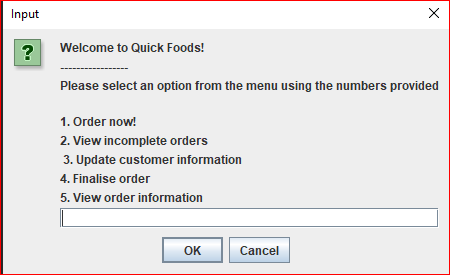
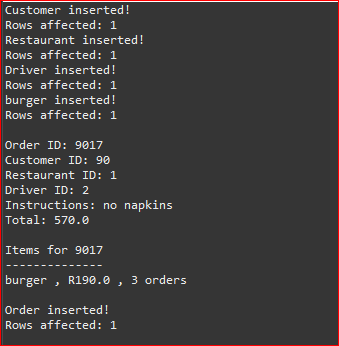
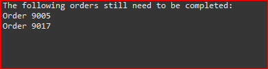

# QuickFood_DB
Updated version of the QuickFood food ordering application that connects to a MySQL database 

This program is designed to allow users to engage with the company, Food Quick's, database
in a number of useful ways. Users can process orders of their own, update customer information,
finalise orders when they are completed, view all orders that still need to be completed, and view
information about a specific order. 

When you first launch the program you will be greeted with an interactive menu where you can input
numbers to select a function of the program to interact with. Please ensure you pick a number from the 
options provided. Depending on the option you select you may be required to enter additional numbers to 
select more options. As with the menu, please ensure you select a number from the options provided.

To place an order select the 'Order now' option and follow the prompts provided to enter information about yourself
and your order. 

Please note when adding a new order that the order ID number you enter must not match any existing entries
in the orders table. 

When asked for ID numbers for each of the people involved in the order please note that existing entries 
will be populated from the database and new entries will require you to provide further information about
the new person. 

Once the order has been placed the following output will be displayed echoing the orders information as shown below 

To update a customer's information select the 'Update customer information' option from the landing page, enter their ID number to 
identify them and follow the remaining prompts on screen to get the updated information and finalise the updates.

To view a list of incomplete orders select the 'View incomplete orders' button to display them as shown below.

To view select orders select the 'View order information' enter either the customer's ID number to view orders belonging to them or the order's ID number to view just
that individual order. When retrieving specific orders note that selecting an order using an ID number will return one unique order
and retrieving using the customer name may return multiple orders.

To finalise an order select the 'Finalise order' option from the landing page and follow the prompts to finalise a select order.

This project was created entirely by Samuel Dudley unless otherwise stated within the source code.
